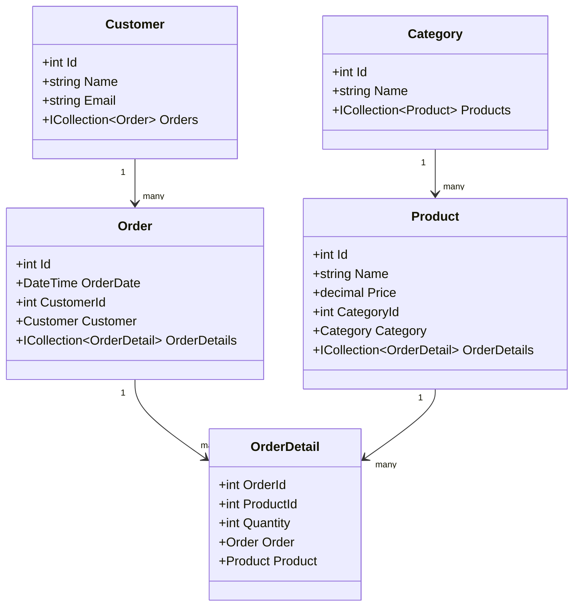

# E-Commerce Class Diagram

```mermaid
classDiagram
    class Category {
        +int Id
        +string Name
        +ICollection~Product~ Products
    }

    class Product {
        +int Id
        +string Name
        +decimal Price
        +int CategoryId
        +Category Category
        +ICollection~OrderDetail~ OrderDetails
    }

    class Customer {
        +int Id
        +string Name
        +string Email
        +ICollection~Order~ Orders
    }

    class Order {
        +int Id
        +DateTime OrderDate
        +int CustomerId
        +Customer Customer
        +ICollection~OrderDetail~ OrderDetails
    }

    class OrderDetail {
        +int OrderId
        +int ProductId
        +int Quantity
        +Order Order
        +Product Product
    }

    Category "1" --> "many" Product
    Customer "1" --> "many" Order
    Order "1" --> "many" OrderDetail
    Product "1" --> "many" OrderDetail
```

