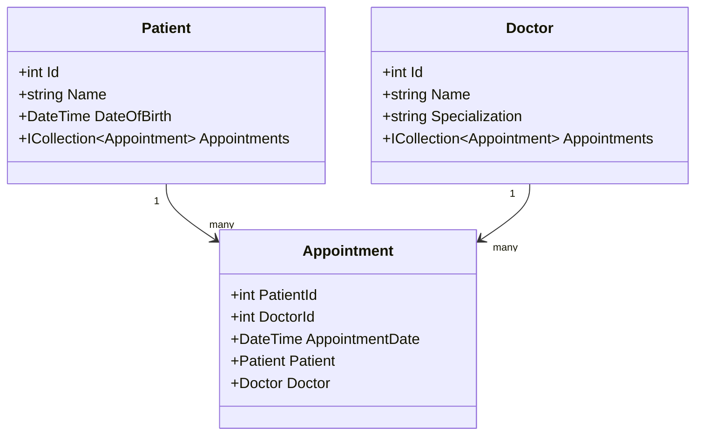

# Health Care Class Diagram

```mermaid
classDiagram
    class Patient {
        +int Id
        +string Name
        +DateTime DateOfBirth
        +ICollection~Appointment~ Appointments
    }

    class Doctor {
        +int Id
        +string Name
        +string Specialization
        +ICollection~Appointment~ Appointments
    }

    class Appointment {
        +int PatientId
        +int DoctorId
        +DateTime AppointmentDate
        +Patient Patient
        +Doctor Doctor
    }

    Patient "1" --> "many" Appointment
    Doctor "1" --> "many" Appointment
```

