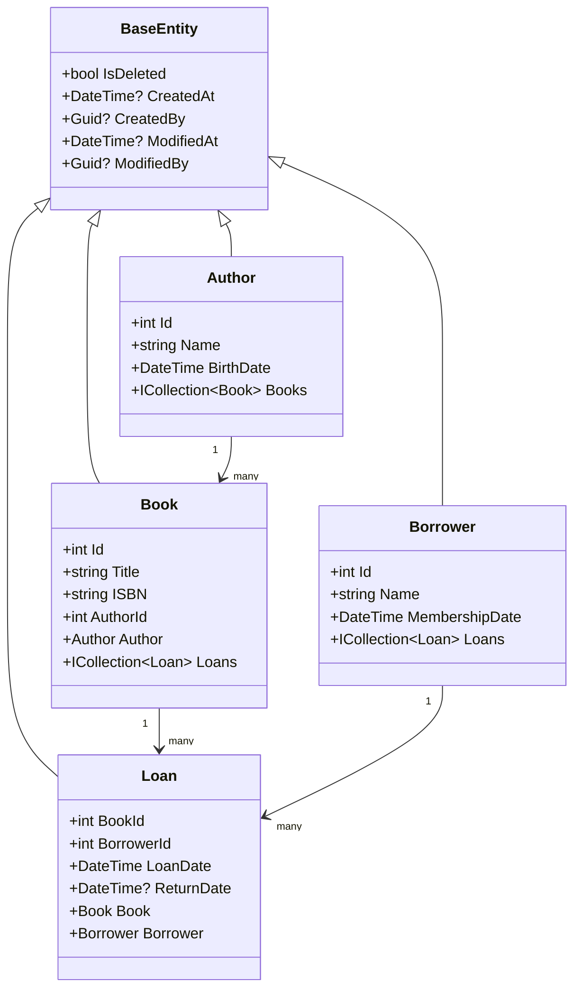

# Library Class Diagram

```mermaid
classDiagram
    class BaseEntity {
        +bool IsDeleted
        +DateTime? CreatedAt
        +Guid? CreatedBy
        +DateTime? ModifiedAt
        +Guid? ModifiedBy
    }

    class Author {
        +int Id
        +string Name
        +DateTime BirthDate
        +ICollection~Book~ Books
    }

    class Book {
        +int Id
        +string Title
        +string ISBN
        +int AuthorId
        +Author Author
        +ICollection~Loan~ Loans
    }

    class Borrower {
        +int Id
        +string Name
        +DateTime MembershipDate
        +ICollection~Loan~ Loans
    }

    class Loan {
        +int BookId
        +int BorrowerId
        +DateTime LoanDate
        +DateTime? ReturnDate
        +Book Book
        +Borrower Borrower
    }

    BaseEntity <|-- Author
    BaseEntity <|-- Book
    BaseEntity <|-- Borrower
    BaseEntity <|-- Loan
    Author "1" --> "many" Book
    Book "1" --> "many" Loan
    Borrower "1" --> "many" Loan
```
